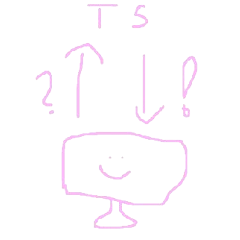

<div align="center">

# WireTyped



</div>

> Small and easy-to-use fetch based client with runtime validation

[](https://github.com/kasperrt/wiretyped/actions/workflows/ci.yml)
[](https://codecov.io/gh/kasperrt/wiretyped)
[](https://bundlejs.com/?q=wiretyped@latest)


Universal fetch-based, typed HTTP client with error-first ergonomics, retries, caching, SSE, and Standard Schema validation.

https://wiretyped.io


## Installation

```sh
pnpm add wiretyped
# or: npm install wiretyped
# or: npx jsr add @kasperrt/wiretyped
```

## What is it?

WireTyped is a small, composable HTTP client for fetch-based runtimes (browser, Node, Bun, Deno, workers). You define your API as typed endpoint definitions and call it with a consistent, error-first API.

## Quick taste

```ts
import { z } from 'zod'; // Or your standard-schema/spec of choice
import { RequestClient, type RequestDefinitions } from 'wiretyped';

const endpoints = {
  '/users/{id}': {
    get: { response: z.object({ id: z.string(), name: z.string() }) },
  },
} satisfies RequestDefinitions;

const client = new RequestClient({
  hostname: 'https://api.example.com',
  baseUrl: '/api',
  endpoints,
  validation: true,
});

const [err, user] = await client.get('/users/{id}', { id: '123' });
if (err) {
  return err;
}
console.log(user.name);
```

## Guide

- [Getting Started](https://wiretyped.io/guide/getting-started)
- [Endpoints](https://wiretyped.io/guide/endpoints)
- [Client](https://wiretyped.io/guide/client)
- [Methods](https://wiretyped.io/guide/methods)
- [Caching](https://wiretyped.io/guide/caching)
- [Retries](https://wiretyped.io/guide/retries)
- [SSE](https://wiretyped.io/guide/sse)
- [Error Handling](https://wiretyped.io/guide/errors)
- [FAQ](https://wiretyped.io/faq)
- [Changelog](https://wiretyped.io/changelog)
